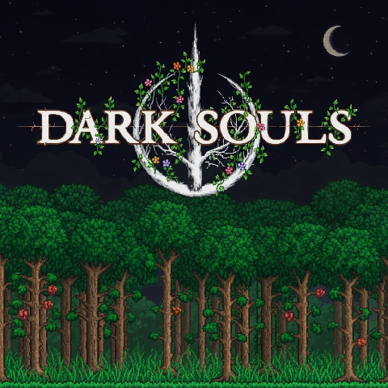

# 黑暗之魂

将《黑暗之魂》系列游戏的内容和机制融入《泰拉瑞亚》

中文 | [English] (README.md)

---

### 基本信息

#### 主要特性和更改
1. 角色升级系统: 体力, 记忆力, 持久力, 力气, 敏捷, 耐力, 智力, 信仰  
2. 在原版泰拉瑞亚的基础上添加了武器、工具的属性补正 
3. 每件武器和工具均需要达到特定属性值方可使用  
4. 经典死亡界面: YOU DIED
5. 替换了界面音效及玩家受伤音效（包含男女角色）  
6. 所有泰拉瑞亚加载界面均已替换为FromSoftware标志
7. 新增生命值与法力值条样式，并额外加入耐力条
8. 无法再使用生命水晶与魔力水晶，最大生命值与最大法力值仅可通过提升**体力**与**记忆力**属性来增加
9. 所有类型的冲刺能力已被内置冲刺取代，该冲刺具备无敌帧，且无敌帧可通过升级提升（类似《黑暗之魂2》的适应力）
10. 升级属性需消耗击败敌对生物获得的灵魂 
11. 支持多人游戏
12. 可通过设置菜单自定义模组选项
13. 加入《黑暗之魂》系列游戏中的饰品
14. 死亡时将丢失所有灵魂与人性，在死亡地点会留下血迹，可返回此处拾取全部丢失物品  

**⚠ 注意 ⚠**  

要激活所有更改，您需要在 tModLoader 设置中启用资源包，并将其设置为最高优先级！

---

### 模组各部分的详细说明

<ol>
  <li><a href="wiki/Stats_ZH.md">玩家状态</a></li>
  <li><a href="wiki/RespecStats_ZH.md">属性加点重置</a></li>
  <li><a href="wiki/ReqParam_ParamBonus_ZH.md">需求能力值与属性补正</a></li>
  <li><a href="wiki/Dodge_ZH.md">闪避机制（冲刺）</a></li>
  <li><a href="wiki/Bloodstain_ZH.md">血迹</a></li>
  <li><a href="wiki/Items_ZH.md">物品</a></li>
  <li><a href="wiki/Hotkeys_ZH.md">快捷键</a></li>
  <li><a href="wiki/Config_ZH.md">模组配置</a></li>
  <li><a href="wiki/ResourcePack_ZH.md">资源包</a></li>
  <li><a href="wiki/Other_ZH.md">其他</a></li>
</ol>

