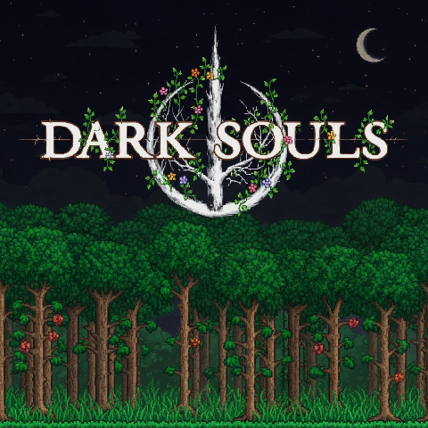

# 黑暗之魂

将《黑暗之魂》系列游戏的内容和机制融入《泰拉瑞亚》

中文 | [English](README.md)

---

### 基本信息

#### 主要特性和更改
1. 角色属性升级系统：生命力、学识、耐力、力量、敏捷、抗性、智力、信仰
2. 来自原版泰拉瑞亚的所有武器与工具将获得属性加成系统（ParamBonus）
3. 原版泰拉瑞亚的每一件武器与工具现在都有使用所需的最低属性（ReqParam）
4. 传奇死亡画面：YOU DIED
5. 替换了界面音效与玩家受伤音效（适用于男女）
6. 所有加载界面背景已更换为 From Software 的标志画面
7. 添加了新的生命值与魔力条样式，并增加了一个耐力条
8. 最大生命值与魔力值现在通过升级生命力与学识提升。无法再使用生命之心与魔力水晶！
9. 所有冲刺方式已被替换为内置冲刺能力，包含无敌帧，可通过提升（类似黑魂2的适应性）增加无敌时间
10. 升级属性需要消耗灵魂，灵魂可通过击杀敌对怪物获得
11. 支持多人联机
12. 可通过设置菜单自定义调整模组
13. 添加了来自《黑暗之魂》系列的饰品
14. 死亡时会失去所有灵魂与人性，死亡地点会生成血迹，通过它可取回一切
15. 来自《黑暗之魂I》（《黑暗之魂：深渊的亚尔特留斯版》原声带）的配乐

⚠️ 注意！

要启用所有改动，请启用资源包并在 tModLoader 设置中将其设为最高优先级！

---

### 模组各部分的详细说明

<ol>
  <li><a href="wiki/Stats_ZH.md">玩家属性</a></li>
  <li><a href="wiki/RespecStats_ZH.md">属性加点重置</a></li>
  <li><a href="wiki/ReqParam_ParamBonus_ZH.md">需求能力值与属性补正</a></li>
  <li><a href="wiki/Dodge_ZH.md">闪避机制（冲刺）</a></li>
  <li><a href="wiki/Bloodstain_ZH.md">血迹</a></li>
  <li><a href="wiki/Items_ZH.md">物品</a></li>
  <li><a href="wiki/Hotkeys_ZH.md">快捷键</a></li>
  <li><a href="wiki/Config_ZH.md">模组配置</a></li>
  <li><a href="wiki/ResourcePack_ZH.md">资源包</a></li>
  <li><a href="wiki/Other_ZH.md">其他</a></li>
</ol>

