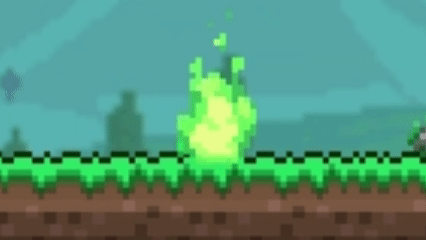

# Bloodstain

A bloodstain with a green glow marks the place of your death.

Touching it (right-click on it nearby or press the hotkey **Touch the bloodstain**) will restore your lost souls and humanity.

If you die again before reaching the previous bloodstain, the souls and humanity will be lost forever, and a new bloodstain will replace the old one.

Also, if you had 0 souls and 0 humanity when you died, no bloodstain will be created.

Each bloodstain is tied to the player and the world, so you can die in two different worlds using the same character and retrieve the souls from each bloodstain separately.

---

### Screenshots and GIFs

#### Bloodstain animation  

#### Chat message when right-clicking the bloodstain  

