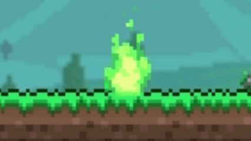
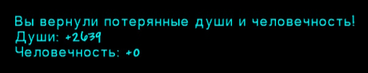

# Пятно Крови

Пятно с зелёным свечением — это место вашей гибели.

Прикоснувшись к нему (нажатие ПКМ по нему рядом с ним или же нажав горячую клавишу **Прикоснуться к пятну крови**), вы восстановите потерянные души и человечность.

Если вы бежали к месту своей гибели и ещё раз были убиты, то души и человечность будут потеряны навсегда, а новое кровавое пятно заменит предыдущее.

Также если у вас было 0 душ и 0 человечности, то пятно крови не будет создано.

Каждое пятно крови привязано к игроку и миру, так что вы можете умереть на двух разных мирах играя за одного игрока и вернуть поочередно души с каждого пятна крови.

---

### Скриншоты и гифки

#### Анимация пятна крови

#### Уведомление в чате при нажатии ПКМ на пятно крови

