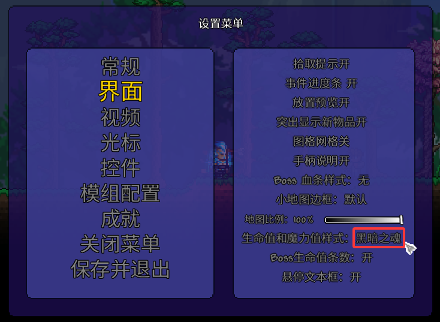
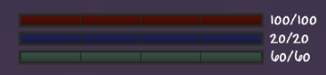

# 关于闪避机制（冲刺）的更多说明

该模组允许角色进行冲刺， **无需装备任何原本提供此能力的饰品** 。

一次冲刺会消耗 **30** 点精力。如果你的精力不足，冲刺将无法发动。

冲刺开始的瞬间，角色会获得 **无敌帧** ，在此期间完全免疫任何形式的伤害。同时，角色还可以穿过敌人。

无敌帧的数量可以通过提升 **抗性** 属性来增加。

冲刺结束后，会有 **0.66 秒的冷却时间** ，在此期间 **无法再次冲刺** ，即使精力已足够！

---

### 关于精力的更多信息

当耐力等级为1时，角色的基础精力值为 **60**。

精力在消耗后几乎会立即开始恢复。

要在屏幕上显示精力条，你需要在游戏设置中选择 **黑暗之魂** 主题（生命值与魔力值样式）。

#### 如何选择指示器主题

#### 游戏内指示器的显示效果

