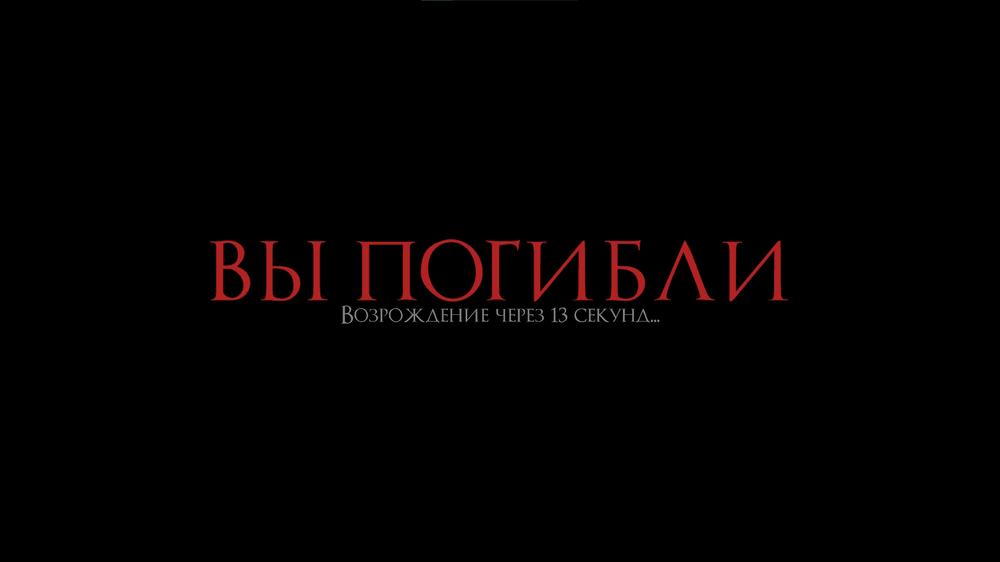
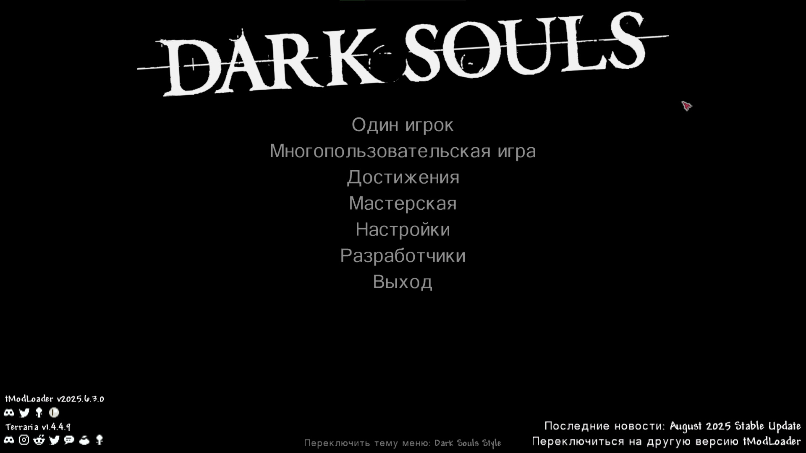

# Подробнение о других изменениях

1. Кристаллы жизни и маны, фрукты жизни нельзя использовать
2. Отключены все разновидности рывков, которые можно было получить от аксессуаров и брони
3. При получении урона персонажем может проиграться один из 10 разных звуков получения урона из Dark Souls
4. При смерти персонажа мужского пола может проиграться один из 2 разных звуков смерти из Dark Souls (1 - обычная смерть, 2 - смерть от падания)
5. При смерти персонажа женсого пола будет проигрываться один и тот же звук смерти из Dark Souls (1 - обычная смерть)
6. При убийстве враждебного существа вы получаете души с характерным звуком из Dark Souls
7. При смерти персонажа на весь экран выводится окно похожее на экрана смерти Dark Souls (звук экрана смерти также сюда входит):

8. В главное меню игры добавлен тема меню **Dark Souls Style**, при выборе этой темы будет воспроизведен звук загрузки меню Dark Souls, а также на фоне будет играть композиция **A Moment's Peace**:

