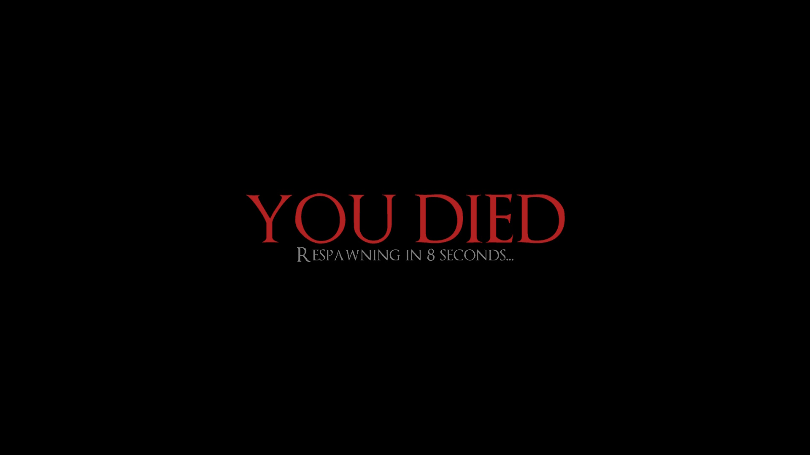
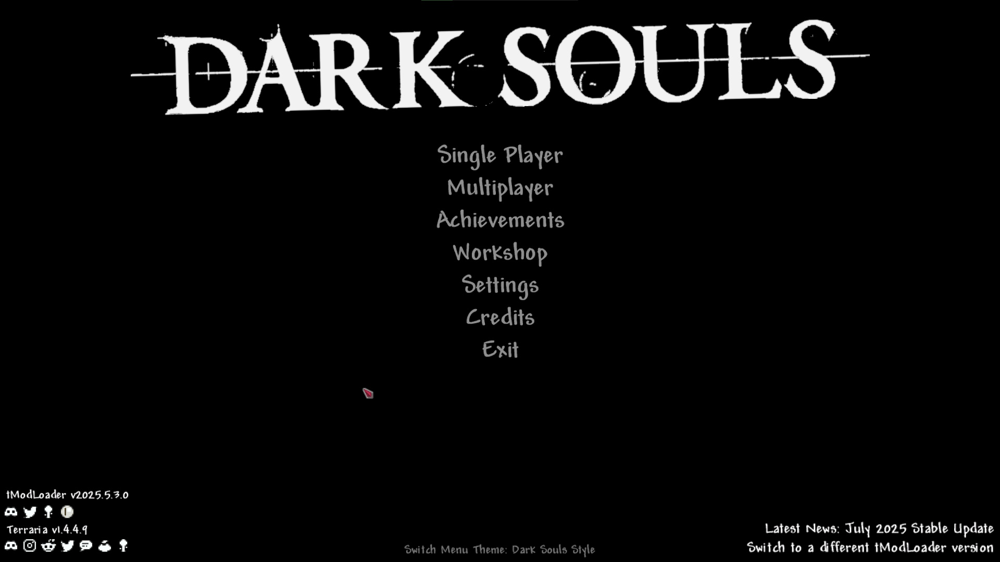

# Details About Other Changes

1. 生命水晶、魔力水晶和生命果无法再使用
2. 所有由饰品和盔甲提供的冲刺能力均已禁用
3. 当角色受到伤害时，会随机播放10种不同的《黑暗之魂》受伤音效之一
4. 当男性角色死亡时，会随机播放2种不同的《黑暗之魂》死亡音效之一：  
   – 标准死亡音效
   – 坠落致死音效
5. 当女性角色死亡时，总会播放一个固定的《黑暗之魂》死亡音效（标准死亡）
6. 当你击杀一个敌对生物时，会获得灵魂，同时伴随《黑暗之魂》中标志性的吸收灵魂音效
7. 死亡时，会显示一个类似《黑暗之魂》死亡界面的全屏消息（包含死亡界面音效）：

8. 主菜单中新增了一个 **黑暗之魂风格** 的主题。当选择此主题时，主菜单的加载音效会变为《黑暗之魂》的音效，背景音乐也会变为 **片刻宁静**（A Moment's Peace）：

