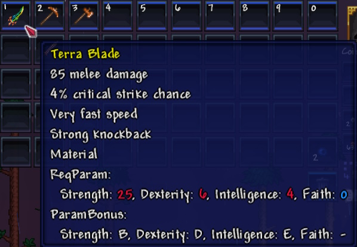
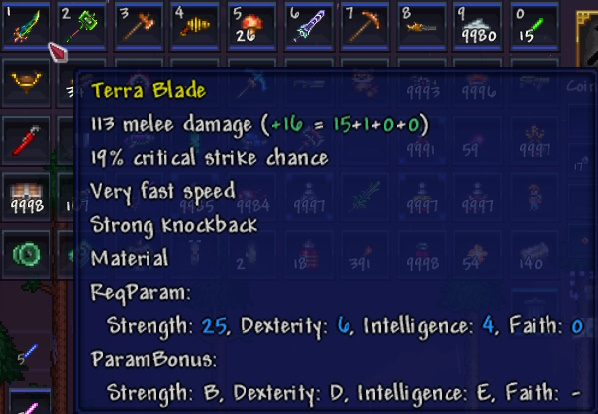

# 关于所需属性和属性补正

---

现在，《泰拉瑞亚》中的所有武器和工具都要求角色的一个或多个属性达到 **最低等级** （**所需属性**）。  
此外，大多数武器和工具会根据你的属性进行补正，从而基于你的属性值提供额外的伤害加成（**属性补正**）。

---

### 补正等级

| 序号 | 补正等级 | 倍率         |
|----|------------------|-------------|
| 1  | S                | 0.85 (85%)  |
| 2  | A                | 0.65 (65%)  | 
| 3  | B                | 0.45 (45%)  | 
| 4  | C                | 0.35 (35%)  | 
| 5  | D                | 0.25 (25%)  | 
| 6  | E                | 0.15 (15%)  | 
| 7  | -                | 0 (0%)      | 

在实际游戏中，你无需记住确切的倍率数值——只需记住：  
**补正等级越接近 S，每点属性带来的额外伤害加成就越高**

第7级（用“–”表示）意味着 **完全没有补正加成** ，这是正常情况。

---

### 附加信息

所有 **所需属性** 和 **属性补正** 的数值都会显示在《泰拉瑞亚》中每个武器和工具物品提示信息的底部（只需将鼠标悬停在物品图标上即可查看）

如果你未达到所需的属性等级，你将 **无法使用** 该物品。  
此外，未满足的属性需求将以 **红色高亮显示** 。

如果所有所需的属性等级都已满足，所需的属性值将以 **蓝色高亮显示** 。

#### 属性需求未满足的示例

#### 属性需求已满足的示例

额外伤害的计算方式是： **力气、敏捷、智力和信仰** 这四项属性 **补正加成的总和** 。

额外伤害的数值会在武器提示信息中以 **绿色文字** 显示，并在基础伤害描述后用括号标注。
