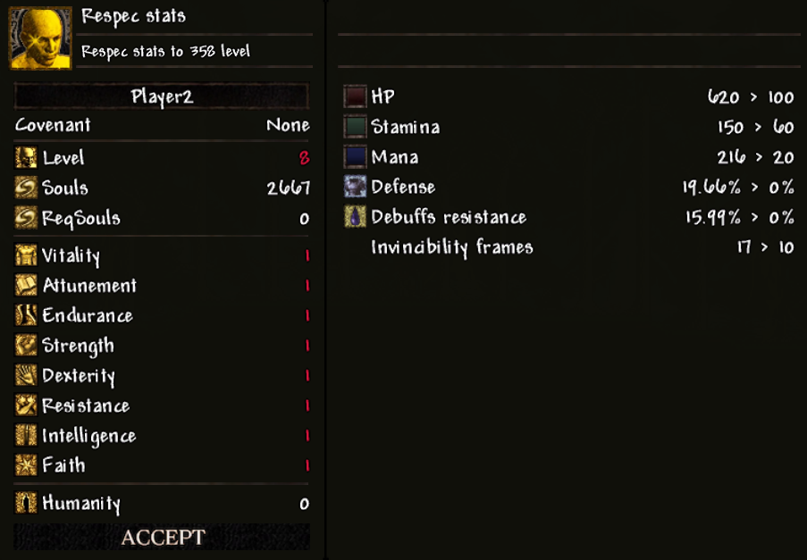

# Player Stat Reallocation

With the help of a **Fire Keeper Soul**, you can reallocate your current level's stat points from scratch.

For example, if you were level 125, you can reassign your stats 117 times (since the default player level is 8).

To open the reallocation menu, you must close the Stats window and use the **Fire Keeper Soul** — a new window will appear:

In this window, you do everything the same way as when leveling up at a bonfire. The **Accept** button becomes active only if both of the following conditions are met:

1. You have reached the level you had before the reallocation (the **Level** value lights up white).
2. You still have the **Fire Keeper Soul** in your inventory.

After pressing **Accept**, the **Fire Keeper Soul** will be consumed, your new stat allocations will be saved, and the window will switch to the **Status** window.
