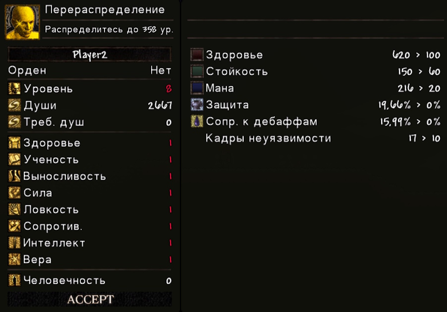

# Перераспределение характеристик персонажа

С помощью **Души Хранительницы Огня** можно перераспределить текущий уровень по характеристикам персонажа с нуля.

То есть, если у вас был, например, 125 уровень, вы можете изменить характеристики 117 раз (так как стандартный уровень персонажа — 8).

Чтобы вызвать нужное меню, необходимо закрыть окно с характеристиками и использовать **Душу Хранительницы Огня** — перед вами появится окно:

В этом окне вы делаете всё то же самое, что и при повышении уровня у костра. Кнопка **Accept** станет активной, если выполняются оба условия:

1. Вы достигли уровня, который был у вас до перераспределения (значение **Уровень** подсветилось белым).
2. В вашем инвентаре всё ещё присутствует **Душа Хранительницы Огня**.

После нажатия **Accept**, **Душа Хранительницы Огня** будет потрачена, новые характеристики сохранятся, и окно сменится на окно **Статус**.
