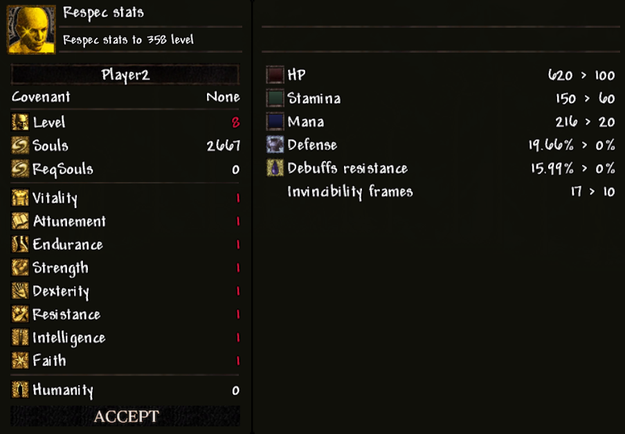

# Player Stat Reallocation

借助 **防火女之魂** ，你可以从头开始重新分配当前等级的所有属性点。

例如，如果你的角色等级为125级，你将可以重新分配117次属性点（因为玩家的初始等级默认为8级）。

要打开重分配菜单，你必须先关闭属性窗口，然后使用 **防火女之魂** ——此时会出现一个新窗口：

在这个窗口中，你的操作方式与在篝火处升级时完全相同。 **Accept** 按钮仅在同时满足以下两个条件时才会激活：

1. 你已将属性点重新分配至与重置前相同的总等级（此时 **等级** 数值会变为白色）。
2. 你的物品栏中仍然拥有 **防火女之魂** 。

按下 **Accept** 后， **防火女之魂** 将被消耗，你的新属性分配将被保存，窗口将切换至 **属性** 窗口。