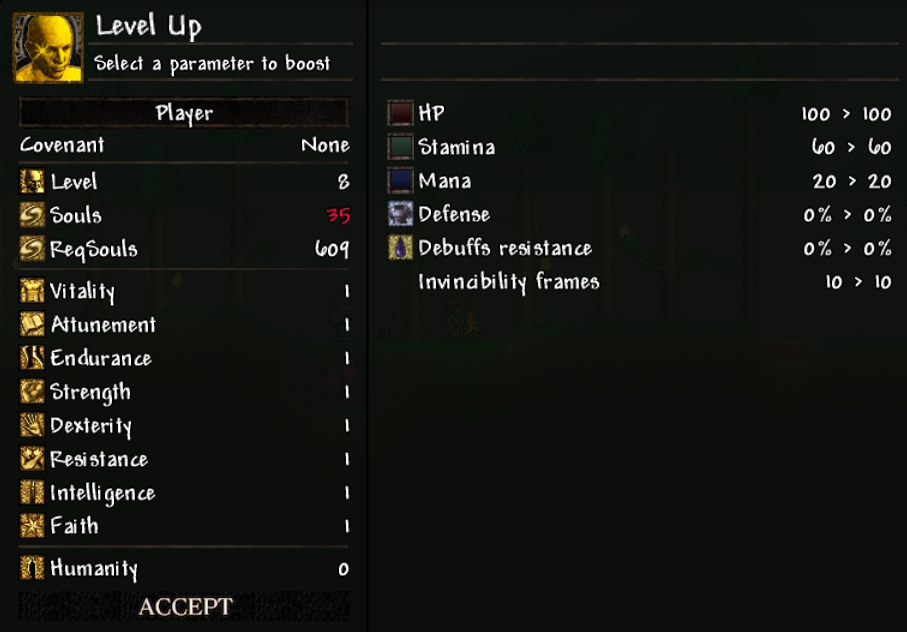

# More About Player Stats

---

### Description of Stats

| №  | Stat            | Effect |
|----|------------------|--------|
| 1  | Vitality         | Increases the player's maximum health |
| 2  | Attunement       | Increases the player's maximum mana |
| 3  | Endurance        | Increases the player's maximum stamina |
| 4  | Strength         | Increases Strength-based damage and allows wielding weapons that require Strength |
| 5  | Dexterity        | Increases Dexterity-based damage and allows wielding weapons that require Dexterity |
| 6  | Resistance       | Increases damage reduction and invincibility frames when dashing (similar to Adaptability from Dark Souls 2); reduces debuff duration |
| 7  | Intelligence     | Increases Intelligence-based damage and allows wielding weapons that require Intelligence |
| 8  | Faith            | Increases Faith-based damage and allows wielding weapons that require Faith |
| 9  | Humanity         | Increases the player's luck |

---

### How to Level Up Stats

All of the listed stats can be leveled up through the **Level Up Menu**, which is opened by right-clicking on the placed **Bonfire (Dark Souls)** from the mod.

#### Level Up Menu

This screenshot shows the level-up window of a newly created player.

The right panel is used for stat distribution. The left panel displays the resulting changes after pressing the **Accept** button.

The **Souls** value shows your current number of souls. If it’s red, you don’t have enough to level up; if it’s white, you do.

**ReqSouls** indicates the cost to raise your level by 1.

Each new level increases the required souls for the next level.  
For levels 1–26, the cost increases by 2.5% each level.  
From level 35 onward, a second (cubic) formula is used, increasing the cost non-linearly — the higher the level, the steeper the cost curve.

To increase a stat level, left-click (**LMB**) on the desired stat. It will highlight in blue.

To decrease a stat level (after increasing it), right-click (**RMB**) on the stat. If reduced back to the original level, it will turn white again.

After distributing points, click **Accept** (the button will light up if changes were made) to apply them and upgrade your player.

**Note:** If you walk away from the bonfire or press the hotkey that opens/closes the level-up window, all changes will be discarded!

All stats, except humanity, can be leveled from 1 to 99.

Each stat, except humanity, has its own **soft caps** that reduce the efficiency of further leveling.

---

### Stat Leveling Efficiency

#### Vitality

| Vitality Level | Max Health Gain per Level | Max Value at End of Range |
|----------------|---------------------------|----------------------------|
| 1–21           | +15 HP                    | 400 HP                     |
| 22–41          | +5 HP                     | 500 HP                     |
| 42–98          | +2 HP                     | 614 HP                     |
| 99             | Rounded to nearest 10     | 620 HP                     |

#### Attunement

| Attunement Level | Max Mana Gain per Level | Max Value at End of Range |
|------------------|-------------------------|----------------------------|
| 1–10             | +20 Mana                | 200 Mana                   |
| 11–98            | +2 Mana                 | 376 Mana                   |
| 99               | Rounded to nearest 10   | 380 Mana                   |

#### Endurance

| Endurance Level | Max Stamina Gain per Level | Max Value at End of Range |
|------------------|----------------------------|----------------------------|
| 1–11             | +3 Stamina                 | 90 Stamina                 |
| 12–41            | +2 Stamina                 | 150 Stamina                |
| 42–98            | +1 Stamina                 | 207 Stamina                |
| 99               | Rounded to nearest 10      | 210 Stamina                |

#### Strength

| Strength Level | Strength Potential Gain per Level | Max Value at End of Range |
|----------------|------------------------------------|----------------------------|
| 1–41           | +2.125% Potential                  | 85% Potential              |
| 42–99          | +0.258% Potential                  | 100% Potential             |

#### Dexterity

| Dexterity Level | Dexterity Potential Gain per Level | Max Value at End of Range |
|-----------------|-------------------------------------|----------------------------|
| 1–41            | +2.125% Potential                   | 85% Potential              |
| 42–99           | +0.258% Potential                   | 100% Potential             |

#### Resistance (Damage Reduction)

| Resistance Level | Damage Reduction Gain per Level | Max Value at End of Range |
|------------------|----------------------------------|----------------------------|
| 1–26             | +0.6% Damage Reduction           | 15% Damage Reduction       |
| 27–99            | +0.137% Damage Reduction         | 25% Damage Reduction       |

#### Resistance (Debuff Duration Reduction)

| Resistance Level | Debuff Duration Reduction per Level | Max Value at End of Range     |
|------------------|--------------------------------------|-------------------------------|
| 1–26             | –0.5% Debuff Duration               | 12.5% Reduction               |
| 27–99            | –0.103% Debuff Duration             | 20% Reduction                 |

#### Resistance (Dash Invincibility Frames)

| Resistance Level | iFrame Gain per Level | Max Value at End of Range |
|------------------|------------------------|----------------------------|
| 1–31             | +0.166 iFrames         | 15 iFrames                 |
| 32–99            | +0.075 iFrames         | 20 iFrames                 |

#### Intelligence

| Intelligence Level | Intelligence Potential Gain per Level | Max Value at End of Range |
|---------------------|----------------------------------------|----------------------------|
| 1–51                | +1.7% Potential                        | 85% Potential              |
| 52–99               | +0.208% Potential                      | 100% Potential             |

#### Faith

| Faith Level | Faith Potential Gain per Level | Max Value at End of Range |
|-------------|--------------------------------|----------------------------|
| 1–51        | +1.7% Potential                | 85% Potential              |
| 52–99       | +0.208% Potential              | 100% Potential             |

#### Humanity

| Amount of Humanity | Luck Increase per 1 Humanity | Maximum Value at the End of the Range |
|--------------------|------------------------------|--------------------------------------|
| 1–30               | +0.01 Luck                   | 0.3 Luck                             |
| 31–99              | +0 Luck                     | 0.3 Luck                             |
---

### How to View Player Status

If you don’t click on the bonfire, but instead press the hotkey that opens/closes the level-up window, you’ll open the same menu, **but in read-only mode** — you can’t level up, and the left panel will change to display your **current stat values** (status), such as health, stamina, resistance, and so on.

#### Status Menu (Current Player Stats)

