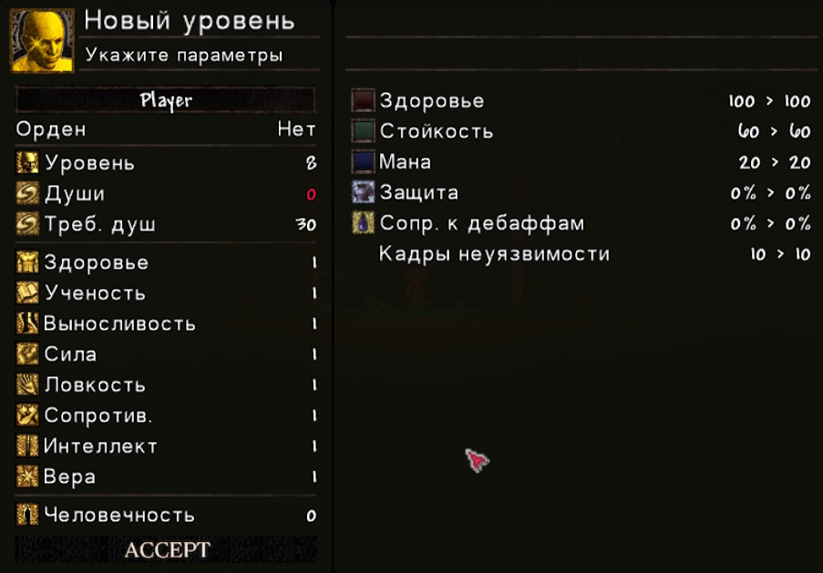
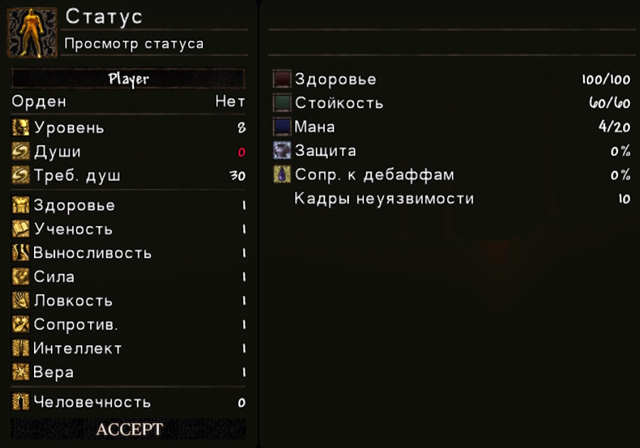

# Подробнее о характеристиках персонажа

---

### Описание характеристик

| №  | Характеристика  | Эффект |
|----|------------------|--------|
| 1  | Жизненная сила (Здоровье) | Повышает максимальный запас здоровья игрока |
| 2  | Ученость        | Повышает максимальный запас маны игрока |
| 3  | Выносливость    | Повышает максимальный запас выносливости |
| 4  | Сила            | Повышает бонус к урону от силы, позволяет использовать оружие, требующее силу |
| 5  | Ловкость        | Повышает бонус к урону от ловкости, позволяет использовать оружие, требующее ловкость |
| 6  | Сопротивление   | Увеличивает поглощение урона и количество кадров неуязвимости при рывке (аналог адаптивности из Dark Souls 2), уменьшает длительность дебаффов |
| 7  | Интеллект       | Повышает бонус к урону от интеллекта, позволяет использовать оружие, требующее интеллект |
| 8  | Вера            | Повышает бонус к урону от веры, позволяет использовать оружие, требующее веру |
| 9  | Человечность    | Повышает удачу игрока |

---

### Как повышать уровень характеристики

Все перечисленые характеристики можно повышать в окне повышение уровня, которое можно открыть нажав **ПКМ** на установленый костер из мода: **Костёр (Dark Souls)**

#### Окно повышение уровня

На этом скриншоте вы видите окно повышения уровня персонажа, который только что был создан

Правое окно отвечает за распределение уровней по характеристикам, левое - показывает какие изменения будут после нажатия кнопки Accept (Принять)

Значение **Souls** это ваш текущий показатель душ, если он горит красным значит у вас не хватает душ на улучшения уровня, если белым, то хватает

Значения **ReqSouls** это стоимость улучшения 1 уровня

Каждый новый уровень любой характеристики поднимает количество требуемых душ на следующий уровень, для первых 26 уровней используется формула которая увеличивает стоимость следующего уровня на 2.5%, после 34 уровня, начиная с 35 используется вторая формула (кубическая), которая нелинейно повышает стоимость (чем больше уровень тем сильнее процент увеличения стоимости) 

Чтобы увеличить уровень какой-то характеристики, нажмите **ЛКМ** по уровню характеристики, и тогда он засветится синим

Чтобы уменьшить уровень какой-то характеристики, после его увеличения, нажмите **ПКМ** по уровню характеристики, если уменьшать таким способом уровень до изначального, то он засветится белым

После всех распределений, нажмите кнопку Accept (она загорится, если были изменения) и таким образом вы улучшите своего персонажа!

**Внимание:** если вы отойдете от костра, или же нажмете горячую клавишу, которая открывает или закрывает окно повышение уровня, то все действия которые вы сделали в окне будут сброшены!!!

Все характеристики, кроме человечности, можно прокачивать до 99 уровня включительно (1 - 99)

У каждой характеристики, кроме человечности, есть свои переходные уровни, которые снижают эффективность прокачки той или иной характеристики

---

### Эффективность прокачки характеристик

#### Жизненная сила
| Уровень жизненной силы | Прирост максимального запаса здоровья за уровень | Максимальное значение в конце отрезка |
|---------|---------------------------|-----------------------------------------------------------------------------|
| 1–21    | +15 HP                    | 400 HP                                                                      |
| 22–41   | +5 HP                     | 500 HP                                                                      |
| 42–98   | +2 HP                     | 614  HP                                                                     |
| 99      | Округление до кратного 10 | 620  HP                                                                     |

#### Ученость
| Уровень учености | Прирост максимального запаса маны за уровень | Максимальное значение в конце отрезка |
|---------|-------------------------------------------------------|---------------------------------------|
| 1–10    | +20 Маны                                              | 200 Маны                              |
| 11–98   | +2 Маны                                               | 376 Маны                              |
| 99      | Округление до кратного 10                             | 380 Маны                              |

#### Выносливость
| Уровень выносливости | Прирост максимального запаса выносливости за уровень | Максимальное значение в конце отрезка |
|---------|-------------------------------------------------------|---------------------------------------------------|
| 1–11    | +3 Выносливости                                       | 90 Выносливости                                   |
| 12–41   | +2 Выносливости                                       | 150 Выносливости                                  |
| 42-98   | +1 Выносливости                                       | 207 Выносливости                                  |
| 99      | Округление до кратного 10                             | 210 Выносливости                                  |

#### Сила
| Уровень силы | Прирост потенциала силы за уровень | Максимальное значение в конце отрезка |
|---------|-----------------------------------------|---------------------------------------|
| 1–41    | +2.125% Потенциала                      | 85% Потенциала                        |
| 42–99   | +0.258% Потенциала                      | 100% Потенциала                       |

#### Ловкость
| Уровень ловкости | Прирост потенциала ловкости за уровень | Максимальное значение в конце отрезка |
|---------|-------------------------------------------------|---------------------------------------|
| 1–41    | +2.125% Потенциала                              | 85% Потенциала                        |
| 42–99   | +0.258% Потенциала                              | 100% Потенциала                       |

#### Сопротивление (Поглощение урона)
| Уровень сопротивления | Прирост поглощения урона за уровень | Максимальное значение в конце отрезка |
|---------|---------------------------------------------------|---------------------------------------|
| 1–26    | +0.6% Поглощения урона                            | 15% Поглощение урона                  |
| 27–99   | +0.137% Поглощения урона                          | 25% Поглощение урона                  |

#### Сопротивление (Уменьшения длительность дебаффов)
| Уровень сопротивления | Прирост уменьшения длительность дебаффов за уровень | Максимальное значение в конце отрезка |
|---------|-------------------------------------------------------------------|---------------------------------------|
| 1–26    | +0.5% Уменьшения длительность дебаффов                            | 12.5% Уменьшения длительность дебаффов|
| 27–99   | +0.103% Уменьшения длительность дебаффов                          | 20% Уменьшения длительность дебаффов  |

#### Сопротивление (Прирост кадров неуязвимости после рывка)
| Уровень сопротивления | Прирост кадров неуязвимости после рывка за уровень  | Максимальное значение в конце отрезка |
|---------|-------------------------------------------------------------------|---------------------------------------|
| 1–31    | +0.166 Кадров неуязвимости после рывка                            | 15 Кадров неуязвимости после рывка    |
| 32–99   | +0.075 Кадров неуязвимости после рывка                            | 20 Кадров неуязвимости после рывка    |

#### Интеллект
| Уровень интеллекта | Прирост потенциала интеллекта за уровень | Максимальное значение в конце отрезка |
|---------|-----------------------------------------------------|---------------------------------------|
| 1–51    | +1.7% Потенциала                                    | 85% Потенциала                        |
| 52–99   | +0.208% Потенциала                                  | 100% Потенциала                       |

#### Вера
| Уровень веры | Прирост потенциала веры за уровень | Максимальное значение в конце отрезка |
|---------|-----------------------------------------|---------------------------------------|
| 1–51    | +1.7% Потенциала                        | 85% Потенциала                        |
| 52–99   | +0.208% Потенциала                      | 100% Потенциала                       |

#### Человечность
| Количество человечности | Прирост удачи за 1 человечность | Максимальное значение в конце отрезка |
|---------|-----------------------------------------|---------------------------------------|
| 1–30    | +0.01 Удачи                             | 0.3 Удачи                             |
| 31–99   | +0 Удачи                                | 0.3 Удачи                             |

---

### Как посмотреть статус персонажа

Если не кликать на костер, а просто нажать горячую клавишу, которая открывает или закрывает окно повышение уровня, то вы откроете похожее меню как в костре, но без возможности что либо прокачать, также левая часть окна будет немного изменена: там вы увидите текущие значения различных характеристик персонажа (статус), например здоровья, выносливости, сопротивления и т.д.

#### Окно просмотра текущих характеристик персонажа (статус)

 
