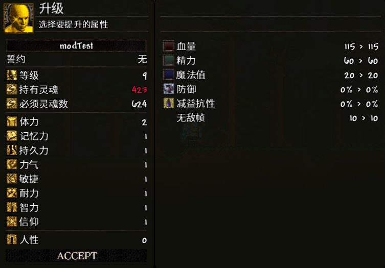
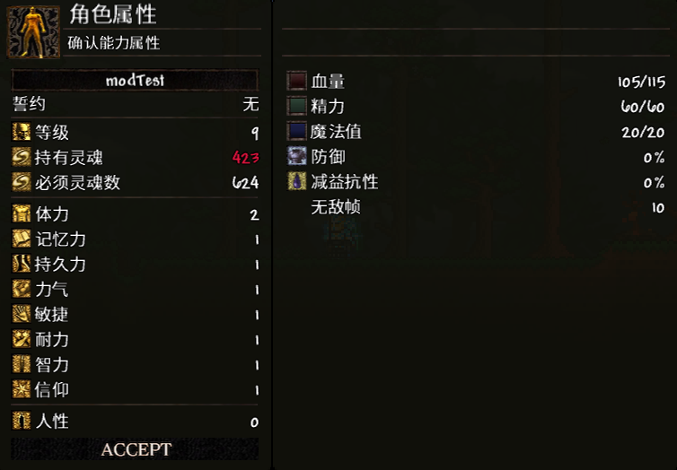

# 关于玩家属性

---

### 属性描述

| 序号 | 属性  | 效果                                           |
|----|-----|----------------------------------------------|
| 1  | 体力  | 提高玩家的最大生命值                                   |
| 2  | 记忆力 | 提高玩家的最大魔力值                                   |
| 3  | 持久力 | 提高玩家的最大精力值                                   |
| 4  | 力气  | 提升基于力量的伤害，并允许使用需要力量才能装备的武器                   |
| 5  | 敏捷  | 提升基于敏捷的伤害，并允许使用需要敏捷才能装备的武器                   |
| 6  | 耐力  | 提升冲刺时的伤害减免和无敌帧数（类似于《黑暗之魂2》中的适应力）；减少减益效果的持续时间 |
| 7  | 智力  | 提升基于智力的伤害，并允许使用需要智力才能装备的武器                   |
| 8  | 信仰  | 提升基于信仰的伤害，并允许使用需要信仰才能装备的武器                   |
| 9  | 人性           | 提高玩家的幸运值 |

---

### 如何升级属性

所有列出的属性都可以通过 **升级菜单** ，该菜单可以通过右键点击模组物品 **黑暗之魂篝火** 打开。

#### 升级菜单

这张截图展示了一个角色的升级界面。

右侧面板用于属性点分配 左侧面板则显示了按下 **Accept** 按钮后将产生的属性变化。

**灵魂** 显示了你当前拥有的灵魂数量。如果数值为红色，表示灵魂不足，无法升级；如果为白色，则表示足够升级。

**必须灵魂数** 表示将等级提升1级所需的灵魂数量。

每升一级，下一级所需的灵魂数量都会增加。  
1至26级期间，每级成本增加2.5%。  
从35级开始，采用三次方公式计算，成本呈非线性增长，也就是说等级越高，成本增长曲线越陡峭。  

要提升某项属性，只需用鼠标左键（ **LMB** ）点击目标属性，它会以蓝色高亮显示。

若要减少已提升的属性点（仅限已增加的点数），可用鼠标右键（ **RMB** ）点击该属性。如果将其减回原始等级，数值将再次变为白色。

完成属性点分配后，点击 **Accept** 按钮（若已做出更改，按钮会亮起）以应用更改并完成角色升级。

**注意** ：如果你离开篝火范围，或按下打开/关闭升级窗口的快捷键，所有未确认的更改都将被丢弃！

除人性外，所有属性均可升级至99级（含1至99级）。

每个属性（除人性外）都有过渡等级，这些等级会降低该属性升级的效果。

---

### 属性升级效率

#### 体力

| 体力等级  | 每级最大生命值增长   | 范围末尾的最大值 |
|-------|-------------|----------|
| 1–21  | +15 HP      | 400 HP   |
| 22–41 | +5 HP       | 500 HP   |
| 42–98 | +2 HP       | 614 HP   |
| 99    | 四舍五入到最接近的10 | 620 HP   |

#### 记忆力

| 记忆力等级 | 每级最大魔力增长    | 范围末尾的最大值 |
|-------|-------------|----------|
| 1–10  | +20 魔力      | 200 魔力   |
| 11–98 | +2 魔力       | 376 魔力   |
| 99    | 四舍五入到最接近的10 | 380 魔力   |

#### 持久力

| 持久力等级 | 每级最大精力增长    | 范围末尾的最大值 |
|-------|-------------|----------|
| 1–11  | +3 精力       | 90 精力    |
| 12–41 | +2 精力       | 150 精力   |
| 42–98 | +1 精力       | 207 精力   |
| 99    | 四舍五入到最接近的10 | 210 精力   |

#### 力气

| 力气等级  | 力量每级潜力增长   | 范围末尾的最大值 |
|-------|------------|----------|
| 1–41  | +2.125% 潜力 | 85% 潜力   |
| 42–99 | +0.258% 潜力 | 100% 潜力  |

#### 敏捷

| 敏捷等级  | 敏捷每级潜力增长   | 范围末尾的最大值 |
|-------|------------|----------|
| 1–41  | +2.125% 潜力 | 85% 潜力   |
| 42–99 | +0.258% 潜力 | 100% 潜力  |

#### 耐力 (伤害减免)

| 耐力等级  | 每级伤害减免增长     | 范围末尾的最大值 |
|-------|--------------|----------|
| 1–26  | +0.6% 伤害减免   | 15% 伤害减免 |
| 27–99 | +0.137% 伤害减免 | 25% 伤害减免 |

#### 耐力 (减益持续减免)

| 耐力等级  | 每级提供的减益减免    | 范围末尾的最大值 |
|-------|--------------|----------|
| 1–26  | –0.5% 减益减免   | 12.5% 减免 |
| 27–99 | –0.103% 减益减免 | 20% 减免   |

#### 耐力 (冲刺无敌帧)

| 耐力等级  | 每级提供的无敌帧 | 范围末尾的最大值 |
|-------|----------|----------|
| 1–31  | +0.166 帧 | 15 帧     |
| 32–99 | +0.075 帧 | 20 帧     |

#### 智力

| 智力等级  | 智力每级潜力增长   | 范围末尾的最大值 |
|-------|------------|----------|
| 1–51  | +1.7% 潜力   | 85% 潜力   |
| 52–99 | +0.208% 潜力 | 100% 潜力  |

#### 信仰

| 信仰等级  | 信仰每级潜力增长   | 范围末尾的最大值 |
|-------|------------|----------|
| 1–51  | +1.7% 潜力   | 85% 潜力   |
| 52–99 | +0.208% 潜力 | 100% 潜力  |

#### 人性

| 人性数量 | 每1点人性增加的幸运值 | 区间结束时的最大值 |
|----------|-----------------------|-------------------|
| 1–30     | +0.01 幸运             | 0.3 幸运           |
| 31–99    | +0 幸运               | 0.3 幸运           |

---

### 如何查看当前角色属性

如果你不点击篝火，而是按下打开/关闭升级窗口的快捷键，你将打开相同的菜单，但处于 **只读模式** ——你无法进行升级，左侧面板将变为显示你的 **当前属性数值** ，例如生命值、耐力值、耐力等。

#### 属性菜单 (当前角色属性)

